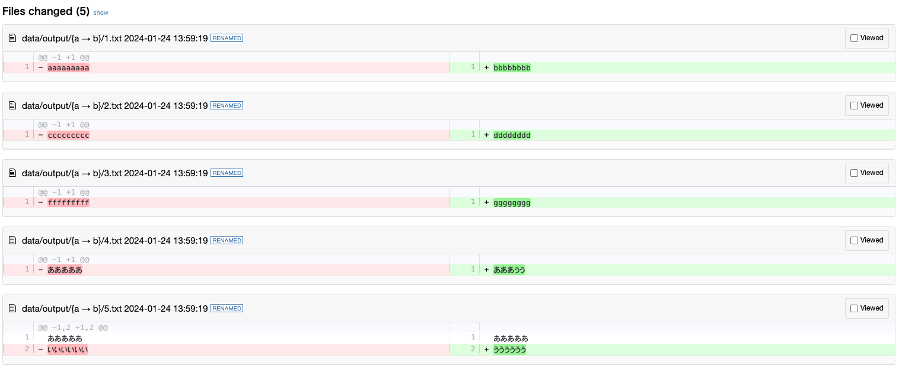

# DIFFを出すツール

# インストール

## venvの作成

```bash
python -m venv venv
```

## venvの有効化

```bash
source venv/bin/activate
```

## パッケージのインストール

```bash
pip install -r requirements.txt
```

## npmパッケージのインストール

```bash
npm install
```

# 使い方
## ファイルの配置
`data/input.csv` に比較したいファイルを配置する

### input.csvファイルのフォーマット
```text
ID,TEXT1,TEXT2
1,比較したい文字A,比較したい文字B
2,"改行もOK
改行もOK","改行もOK"
```
※ 改行がある場合はダブルクォーテーションで囲む

## 比較用のファイルを作成
```bash
python main.py
```

## DIFFを取る
```bash
diff -u data/output/a data/output/b | npx diff2html --input stdin --style side
```

## 出力サンプル
